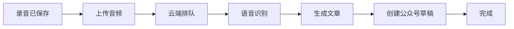

# VibePub Android Product Requirements

Date: 2026-06-29
Reference: VoiceDrop feature summary article, "VoiceDrop 完成了五个功能以后，封版三天"

## North Star

VibePub Android is a spoken-idea-to-WeChat-draft product, not a generic recorder.

The most valuable job is reducing writing cost: the user records an idea, the system turns it into a publishable article, and the app makes the long processing path understandable enough that the user can trust it without reading logs.

## Current Stage

This stage is an internal Android dogfood version. It should feel daily-usable for one core loop:

1. Record a spoken idea.
2. Upload audio.
3. Process the audio through ASR and article generation.
4. Create or prepare a WeChat Official Account draft.
5. Return to the app to review, play original audio, copy/share text, and open the draft when available.

It is not a public social product yet. The app should avoid account, community, public publishing, and full voice-editing complexity until the core loop is reliable.

## Reference Product Mapping

The reference product describes five capability layers:

| Reference Layer | VibePub Android Decision |
| --- | --- |
| Recording | In scope now. Recording must be calm, reliable, non-duplicating, and recoverable. |
| Processing and rewriting | In scope now as visible output and progress. The app should show generated title, article body, raw transcript preview, and processing stage. |
| Voice-driven article modification | Defer. This is important, but not required for the first trusted Android dogfood loop. |
| WeChat Official Account draft | In scope now. Android never stores WeChat secrets, but should show draft readiness and open the draft URL when backend provides it. |
| Community sharing and voice replies | Defer. Sharing must be explicit in a later product stage. |

## Primary User Workflow

### Start Recording

The user opens the app and sees a workbench, not a file manager. The primary action is recording a thought. The recording screen should tolerate pauses and make the user feel that stopping to think is normal.

Required behavior:

- Show live audio feedback so the user knows the microphone is working.
- Protect against accidental zero-second recordings.
- Prevent duplicate stop actions.
- After stopping, return to the workbench immediately with one new item.
- The item starts in a visible "uploading" or "processing" state.

### Track Processing

The processing path is long and multi-service. The app must expose enough state to be trustworthy while keeping the default view simple.

Default workbench card:

- Title fallback: generated `articleTitle` first; otherwise created time plus recording snippet.
- Duration.
- Created time.
- Compact status.
- Recent cloud sync freshness.
- Info icon for status explanation.
- Failure reason when blocked.
- Entry to detail.

Status info surface:

- Current product-facing status.
- Current backend stage when available.
- Full lifecycle from recording to WeChat draft.
- Which steps are done, current, waiting, or blocked.
- Expected user action, such as wait, refresh, retry upload, fix token, or inspect diagnostics.

### Review Result

The detail screen is the place to consume the result. It should make the article and its publication readiness obvious.

Required content:

- Local audio player with play/pause, seek, elapsed time, and total duration.
- Raw transcript preview when available.
- Generated article title.
- Generated article body rendered as readable plain text, not raw HTML.
- WeChat draft status, draft id, media id, or draft URL when available.
- Publish-readiness review that distinguishes:
  - still processing,
  - article ready but draft pending,
  - draft ready,
  - failed or configuration blocked.
- Copy title, copy body, system share body, and open draft actions.

### Recover From Failure

Failures should not look like endless processing.

Required behavior:

- Token/auth failures map to configuration error guidance.
- Network and server failures retain retry paths.
- Backend stage failures show the most specific available reason.
- Diagnostics expose API host, device id, last upload filename, last error, recent sync time, and app version.

## Product-Facing Lifecycle

The Android UI should not leak every internal implementation detail by default. It should map the pipeline into this user-facing lifecycle:

Recommended compact labels:

| Local/Remote State | Default Label | Info Tooltip Meaning |
| --- | --- | --- |
| `LOCAL_RECORDED` | 待上传 | 音频已在本机保存，还没有成功上传到云端。 |
| `UPLOADING` | 上传中 | App 正在把音频上传到后端。 |
| `UPLOADED` | 已上传 | 云端已收到音频，等待处理任务接手。 |
| `PROCESSING` | 处理中 | 云端正在排队、识别、成文或创建公众号草稿。 |
| `COMPLETED` | 已成文 | 文章结果已经可查看；如果有草稿 URL，可打开公众号草稿继续确认。 |
| `FAILED` | 需要处理 | 当前流程被配置、网络、服务或生成错误阻塞，需要按提示重试或修复。 |

Backend `processingStage` should refine the info surface:

- `uploaded`: 云端已收到音频。
- `asr`: 正在转成文字。
- `article`: 正在整理成文章。
- `wechat`: 正在创建公众号草稿。
- `completed`: 文章和同步结果已完成。
- `failed`: 当前阶段失败。

## Scope

### Must Have For This Stage

- Reliable one-recording-one-item behavior.
- Non-zero duration protection.
- Workbench status, failure reason, and latest sync freshness.
- Status info icon on workbench and detail.
- Detail playback.
- Article title/body display.
- WeChat draft readiness and open-draft action when backend provides URL.
- Copy/share/export actions for generated text.
- Settings for API base URL and `FILES_TOKEN`.
- Connection test for `/health` and authorized `/api/recordings`.
- Diagnostics good enough for screenshot-based support.
- Real-device automated smoke evidence.

### Should Have For This Stage

- Better empty states and stale-sync hints.
- Clear low-volume feedback during recording.
- Manual refresh on workbench and detail.
- Retry upload/sync entry points.
- Visual distinction between "article ready" and "draft ready".

### Later

- Voice-driven article modification.
- Combining multiple recordings into one article.
- User style fingerprint management.
- Remembered writing preferences.
- Community sharing.
- Voice replies and article-to-article links.
- Public accounts and multi-user permissions.
- Formal app-store distribution.

## Acceptance Criteria

- A tester can complete recording, processing, article review, original audio playback, copy/share, and WeChat draft opening without reading logs.
- The workbench shows one item for one recording attempt, with no zero-second duplicates.
- The user can tap a status info icon and understand the full flow, the current step, and the next expected action.
- Completed recordings show article content and `COMPLETED`-quality status on both workbench and detail.
- Failed recordings show a clear reason and a path to retry or fix configuration.
- The app contains no Apple, iCloud, or TestFlight copy in user-facing Android surfaces.
- The latest install source remains GitHub Releases, and `artifacts/MANIFEST.md` points to the current APK.

## Product Risks

- If processing progress is too opaque, users will assume the app lost their recording.
- If the app looks like a recorder, users may miss the higher-value writing and draft workflow.
- If WeChat draft status is ambiguous, users will not know whether publishing still needs manual confirmation.
- If failure states are hidden, internal dogfood will produce screenshots that cannot be debugged quickly.
