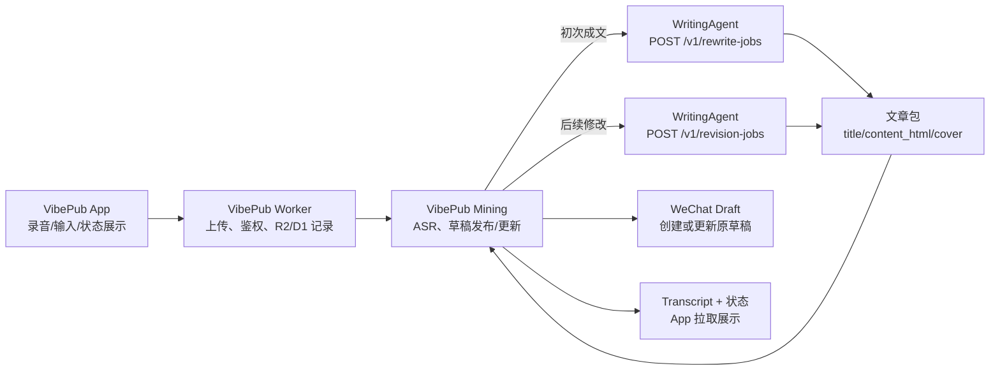

# WritingAgent Rewrite Protocol v1

WritingAgent 是独立于 VibePub 的文章改写平台。VibePub 负责录音、ASR、状态追踪、公众号草稿创建和 App 展示；WritingAgent 负责根据用户选择的写作风格画像和公众号排版要求，把原始文字改写成公众号文章包，并根据用户后续修改指令生成新版文章包。

## 设计目标

- VibePub 继续传入写作风格；排版默认由 WritingAgent 的审核、版本化、声明式 formatting Skill 代码注册表决定。
- WritingAgent 是 VibePub 产品模块；每个 formatting Skill 是其内部可替换的完整 adapter，独立拥有提示指令、标题规则、inline style 与复杂内容降级，主任务流程不判断具体 Skill。
- `md_to_wechat@1.0.0` 是当前默认排版 Skill，旧 `layout_profile_id=wechat_clean_article@2026-07-05` 只作为兼容 alias。
- 初次成文和后续对话/语音修改都由 WritingAgent 决定“文章怎么写”；VibePub 只决定“改哪篇文章、更新哪个公众号草稿、如何展示状态”。
- 写作风格模板会从单一默认提示词演进为可选择、可版本化、可由用户自定义的风格市场。
- 两个系统可以共用身份体系；服务间调用使用 bearer token，用户级权限由 token 中的 `user_id/workspace_id/scope` 或上游网关保证。
- 协议先支持同步返回 `article_ready`，后续可无破坏扩展为异步 job + webhook。

## 系统边界



## 身份验证

所有 `/v1/*` 接口都要求认证：

```http
Authorization: Bearer <service-or-user-token>
```

推荐 scope：

```text
rewrite.jobs:create
rewrite.jobs:read
rewrite.revision_jobs:create
rewrite.profiles:read
rewrite.profiles:write
rewrite.profile_drafts:create
rewrite.profile_drafts:update
```

Webhook 回调后续增加时，需要 `X-WritingAgent-Signature` 和 `X-WritingAgent-Timestamp`。

## Profile 接口

当前代码已实现 `GET /v1/style-profiles`、`GET /v1/layout-profiles`、`GET /v1/formatting-skills`、`GET /v1/formatting-skills/:id`、`POST /v1/rewrite-jobs`、`POST /v1/revision-jobs`、`POST /v1/style-source-imports`、`GET /v1/style-source-imports`、`POST /v1/style-distillation-jobs` 和 `GET /v1/style-distillation-jobs/:id`。Android 也已支持本地自定义模板：模板正文会以内联 `style_profile_body` 方式随录音/文字任务提交给 WritingAgent。

创建/更新自定义模板与风格画像对话草稿仍是下一阶段平台化协议目标；风格素材导入和蒸馏已先以 D1 持久化接口落地，供 VibePub Worker 代理给 Android 使用。

### `GET /v1/style-profiles`

返回当前用户或 workspace 可用的写作风格画像列表。

```json
{
  "style_profiles": [
    {
      "id": "style_litianc_default",
      "name": "litianc 默认写作风格",
      "version": "2026-07-05",
      "description": "真实、理性、结构化、有个人判断但不浮夸。"
    }
  ]
}
```

后续模板市场模式下，列表项会增加：

```json
{
  "id": "style_product_review_default",
  "name": "产品复盘风格",
  "version": "2026-07-05",
  "description": "强判断、短段落、保留具体排查过程。",
  "visibility": "public",
  "owner_type": "system",
  "tags": ["产品", "复盘"],
  "is_default": false
}
```

### `POST /v1/style-profiles`

创建用户自定义写作风格画像。请求方必须具备 `rewrite.profiles:write` scope。服务端根据 token 归属决定 `owner_user_id/workspace_id`，不能信任请求体自称身份。

```json
{
  "name": "我的理性产品复盘风格",
  "description": "短开场、强判断、保留排查过程。",
  "body": "完整风格画像提示词",
  "visibility": "private",
  "tags": ["产品", "技术"]
}
```

### `PUT /v1/style-profiles/:id`

更新用户自定义写作风格画像并生成新版本。公共模板不可原地修改，只能复制为私有模板。

## 风格素材导入与蒸馏

Android 不直接调用 WritingAgent；VibePub Worker 通过 `GET /api/style-profiles`、`POST /api/style-source-imports` 和 `POST /api/style-distillation-jobs` 代理这些接口，并用服务端 `WRITING_AGENT_TOKEN` 调用 WritingAgent。

### `POST /v1/style-source-imports`

导入一条可用于风格蒸馏的参考素材。P0 支持 URL、公众号文章分享文本和纯文本；Word/PDF 文件解析仍作为后续能力。

```json
{
  "source_type": "wechat_article",
  "url": "https://mp.weixin.qq.com/s/example",
  "title": "一篇满意的旧文章",
  "text": "用户分享或复制进来的正文片段"
}
```

响应：

```json
{
  "source_import": {
    "id": "ssi_xxx",
    "workspace_id": "vibepub-dogfood",
    "source_type": "wechat_article",
    "source_url": "https://mp.weixin.qq.com/s/example",
    "title": "一篇满意的旧文章",
    "status": "ready",
    "text_preview": "用户分享或复制进来的正文片段",
    "created_at": "2026-07-06T00:00:00.000Z"
  }
}
```

### `GET /v1/style-source-imports`

按 workspace 返回最近导入的风格素材。

### `POST /v1/style-distillation-jobs`

用一组素材蒸馏出新的私有风格画像或生成已有画像的新版本。当前 MVP 同步返回 `profile_ready`，并默认保留每个 profile 最近 10 个版本。

```json
{
  "source_import_ids": ["ssi_1", "ssi_2"],
  "profile": {
    "id": "style_my_old_articles",
    "name": "我的旧文风格",
    "description": "从满意旧文章提取。"
  }
}
```

响应：

```json
{
  "distillation_job": {
    "id": "sdj_xxx",
    "status": "profile_ready",
    "source_import_ids": ["ssi_1", "ssi_2"]
  },
  "style_profile": {
    "id": "style_my_old_articles",
    "name": "我的旧文风格",
    "version": "2026-07-06T00:00:00.000Z",
    "active_version_id": "spv_xxx",
    "body": "完整写作风格画像提示词"
  }
}
```

## 风格画像对话草稿

### `POST /v1/style-profile-drafts`

创建一个用于多轮对话生成风格画像的草稿。

```json
{
  "seed_profile_id": "style_litianc_default",
  "goal": "创建一个更适合产品复盘的个人公众号风格"
}
```

响应：

```json
{
  "draft_id": "spd_abc123",
  "status": "draft",
  "assistant_message": "我会先基于默认风格创建草稿。你希望文章更像复盘、教程还是观点短文？",
  "draft_profile": {
    "name": "未命名风格",
    "description": "",
    "body": ""
  }
}
```

### `POST /v1/style-profile-drafts/:draft_id/messages`

追加一轮用户偏好。语音由 VibePub 先转成文字，再以 `source_type=voice_transcript` 提交给 WritingAgent。

```json
{
  "source_type": "voice_transcript",
  "text": "我希望真实一点，不要营销味，但要保留具体排查过程。"
}
```

响应返回更新后的 `draft_profile` 和下一轮追问：

```json
{
  "draft_id": "spd_abc123",
  "status": "draft",
  "assistant_message": "已加入：真实、少营销形容词、保留排查过程。是否要保留第一人称？",
  "draft_profile": {
    "name": "真实克制复盘风格",
    "description": "真实、克制、保留排查过程。",
    "body": "当前合成的风格画像提示词"
  }
}
```

### `POST /v1/style-profile-drafts/:draft_id/publish`

把对话草稿发布为正式 `style_profile`。发布前客户端应展示完整 `body` 供用户确认。

### `GET /v1/layout-profiles`

返回可用的公众号排版模板列表。

```json
{
  "layout_profiles": [
    {
      "id": "wechat_clean_article",
      "name": "微信公众号克制长文排版",
      "version": "2026-07-05",
      "description": "使用微信兼容 HTML 片段、短段落、小标题和必要表格。"
    }
  ]
}
```

### Formatting Skills

`GET /v1/formatting-skills` 和 `GET /v1/formatting-skills/:id` 只返回公开 manifest 摘要，例如 id、version、alias、输出合同、允许标签和能力；不会返回内部提示词、adapter 实现或凭据。

```json
{
  "formatting_skills": [
    {
      "id": "md_to_wechat",
      "version": "1.0.0",
      "output_format": "wechat_html_fragment",
      "image_policy": "image_actions_only",
      "aliases": [
        { "type": "layout_profile", "id": "wechat_clean_article", "version": "2026-07-05" }
      ]
    }
  ]
}
```

Rewrite/revision 的 `profiles` 可选传入：

```json
{
  "formatting_skill_id": "md_to_wechat",
  "formatting_skill_version": "1.0.0"
}
```

显式 id 必须同时带 version。未知 id 返回 `404 formatting_skill_not_found`，不可用版本返回 `409 formatting_skill_version_conflict`。新字段与 legacy layout 字段同时传入时，只有两者映射到相同 canonical Skill 才允许；否则返回 `409 formatting_profile_conflict`，不会调用模型或静默回退。未传新旧字段时默认使用 `md_to_wechat@1.0.0`。

MVP 不执行任意 `SKILL.md`、不读取包内 `.env`、不调用 SkillHub 或第三方排版服务，也不下载图片、上传微信 CDN 或直接发布草稿。`content_html` 只保留安全白名单标签；图片继续通过现有 `image_actions` 交给 Mining/发布链路处理。公式和 Mermaid 会降级为可读 code 并返回 warning。

代码 registry 的每个 entry 绑定公开 manifest 与完整 adapter：`buildInstructions` 和 `validateAndNormalizeOutput`。Rewrite/revision 只执行 `resolve -> adapter instructions -> GLM -> adapter normalize`；新增经过审核的 Skill 只增加 registry/adapter 和测试。共享层只保留通用协议错误、完整 HTML5 命名字符引用与十进制/十六进制嵌套实体的语义恢复，以及不可绕过的危险标签、属性、URL 和外图安全检查。兼容 `layout_profile_*` 元数据从所选 adapter 的 alias 派生；没有 legacy alias 的 Skill 不返回伪造的 layout profile。

## 创建改写任务

### `POST /v1/rewrite-jobs`

请求：

```json
{
  "protocol_version": "vibepub.rewrite.v1",
  "client_job_id": "VibePub-2026-07-05-010101-Text-abcd1234.txt",
  "idempotency_key": "VibePub-2026-07-05-010101-Text-abcd1234.txt",
  "user": {
    "user_id": "default_user",
    "workspace_id": "vibepub-dogfood"
  },
  "input": {
    "source_type": "audio_transcript",
    "raw_text": "这是 ASR 或用户输入得到的原始文字。",
    "title_hint": "可选标题提示",
    "language": "zh-CN"
  },
  "profiles": {
    "style_profile_id": "style_litianc_default",
    "style_profile_version": "2026-07-05",
    "layout_profile_id": "wechat_clean_article",
    "layout_profile_version": "2026-07-05"
  },
  "output_contract": {
    "format": "wechat_article_package",
    "content_format": "html_fragment",
    "require_cover_fields": true
  }
}
```

如果用户在 Android 本地新增了私有模板，VibePub 可以在同一 `profiles` 对象中传入内联风格画像。WritingAgent 会优先使用 `style_profile_body`，并把 `style_profile_id/version` 作为追踪字段返回；如果没有 `style_profile_body`，才按 `style_profile_id` 查内置模板。

```json
{
  "profiles": {
    "style_profile_id": "custom_style_1782854400000",
    "style_profile_version": "1782854400000",
    "style_profile_name": "我的产品复盘风格",
    "style_profile_description": "真实克制，保留具体排查过程。",
    "style_profile_body": "完整写作风格画像提示词，最长建议 3000 字符。",
    "layout_profile_id": "wechat_clean_article"
  }
}
```

成功响应：

```json
{
  "protocol_version": "vibepub.rewrite.v1",
  "job_id": "rw_01abcdef",
  "status": "article_ready",
  "result": {
    "title": "文章标题",
    "content_html": "<section><p>公众号正文 HTML 片段</p></section>",
    "summary": "可选摘要",
    "cover": {
      "cover_title": ["第一行", "第二行"],
      "cover_subtitle": "可选副标题",
      "image_prompt": "English image prompt, no text, no logo"
    },
    "warnings": []
  },
  "profile_versions": {
    "style_profile_id": "style_litianc_default",
    "style_profile_version": "2026-07-05",
    "formatting_skill_id": "md_to_wechat",
    "formatting_skill_version": "1.0.0",
    "layout_profile_id": "wechat_clean_article",
    "layout_profile_version": "2026-07-05"
  }
}
```

`image_prompt` 会被 mining 用作封面背景模板选择线索；中文封面标题仍由 VibePub 通过 SVG/Sharp 叠加。GPT Image 2 只用于维护性生成可复用无字背景底稿，不在每篇文章生成时调用。

失败响应：

```json
{
  "error": {
    "code": "invalid_profile",
    "message": "写作风格画像不存在或没有权限"
  }
}
```

## 创建文章修改任务

### `POST /v1/revision-jobs`

VibePub 在用户通过语音或文字提出修改要求后调用此接口。VibePub 仍负责把修改语音转成文字、持有 transcript、公众号草稿 ID 和状态流转；WritingAgent 只根据当前文章和修改指令生成新版文章包。

请求：

```json
{
  "protocol_version": "vibepub.rewrite.v1",
  "client_job_id": "VibePub-2026-07-02-160000-Test.m4a:rev-1",
  "idempotency_key": "VibePub-2026-07-02-160000-Test.m4a:rev-1",
  "user": {
    "user_id": "default_user",
    "workspace_id": "vibepub-dogfood"
  },
  "current_article": {
    "raw_text": "原始口述转录，可选但推荐提供。",
    "title": "当前文章标题",
    "content_html": "<section><p>当前公众号正文 HTML 片段</p></section>"
  },
  "instruction": {
    "source_type": "voice_instruction",
    "text": "把标题换得更直接，并补充一个结论。",
    "language": "zh-CN"
  },
  "profiles": {
    "style_profile_id": "style_litianc_default",
    "style_profile_version": "2026-07-05",
    "layout_profile_id": "wechat_clean_article",
    "layout_profile_version": "2026-07-05"
  },
  "output_contract": {
    "format": "wechat_article_package",
    "content_format": "html_fragment",
    "require_cover_fields": true,
    "allow_image_actions": true
  }
}
```

成功响应与 `/v1/rewrite-jobs` 一致，返回新版 `article_ready` 文章包。若修改指令明确要求配图，`result` 可额外带 `image_actions`：

```json
{
  "result": {
    "title": "新版文章标题",
    "content_html": "<section><p>第一段。</p><p>第二段。</p></section>",
    "image_actions": [
      {
        "image_id": "opening-desk",
        "kind": "insert_image",
        "prompt": "A warm desk with a recorder, no text, no logo, no watermark",
        "alt": "办公桌上的录音设备",
        "anchor": {
          "position": "after",
          "paragraph_index": 1
        }
      }
    ]
  }
}
```

MVP 支持 `kind=insert_image`，`position=start/end/before/after`，`paragraph_index` 从 1 开始。WritingAgent 不直接在 `content_html` 中插入占位图片；VibePub mining 负责生成图片、上传 R2、上传微信正文图并把最终 `` 写入新版正文。

VibePub 收到新版文章包后负责：

- 对带 `parentVersionId` 的修改，同时保留 `feedbackId`，并以请求中绑定的父 Article Version 标题和正文为写作输入，不读取可能过期的 transcript 正文。
- 处理 `image_actions`：生成正文图、写入 `article-images/<filename>/<image_id>.png`、记录 `articleImages[]`。
- 把改写结果、指令、正文图引用和封面字节写入同目录的确定性 `.prepared.json` sidecar，再调用 Worker 创建唯一 child Article Version。
- 在调用公众号前，把 child version ID、版本号和 `ARTICLE_READY` 写入 transcript 与状态接口；如果微信失败，保留新版正文并进入 `DRAFT_FAILED`。
- 重跑同一修改时读取 prepared sidecar，重放 Worker version 接口并只重试微信，不再次执行 ASR、写作、图片或封面生成。

不带 `parentVersionId` 的旧 revision request 继续使用 legacy transcript 修改流程。

## 状态枚举

WritingAgent 对外状态：

```text
accepted
queued
rewriting
article_ready
failed
cancelled
```

VibePub mining 当前 MVP 使用同步 `article_ready`；如果后续切到异步模式，VibePub 将 `accepted/queued/rewriting` 映射到 `REWRITING`，将 `article_ready` 映射到 `ARTICLE_READY`。

## VibePub 接入环境变量

`infra/mining` 通过以下环境变量接入 WritingAgent：

```text
WRITING_AGENT_BASE_URL
WRITING_AGENT_TOKEN
WRITING_AGENT_STYLE_PROFILE_ID
WRITING_AGENT_STYLE_PROFILE_VERSION
WRITING_AGENT_LAYOUT_PROFILE_ID
WRITING_AGENT_LAYOUT_PROFILE_VERSION
```

如果 `WRITING_AGENT_BASE_URL` 未配置，VibePub 保留原来的内置 GLM 初稿改写和文章修改路径作为 fallback。

正文配图 MVP 由 `infra/mining` 在用户明确要求插图的 revision 中触发，使用独立图片生成配置；未配置时，含 `image_actions` 的 revision 会进入 `REVISION_FAILED`，不会覆盖旧文章：

```text
ARTICLE_IMAGE_BASE_URL
ARTICLE_IMAGE_API_KEY
ARTICLE_IMAGE_MODEL
ARTICLE_IMAGE_SIZE
ARTICLE_IMAGE_TIMEOUT_MS
```

缺省可回退读取已有 `GPT_IMAGE_*` 图片配置。
