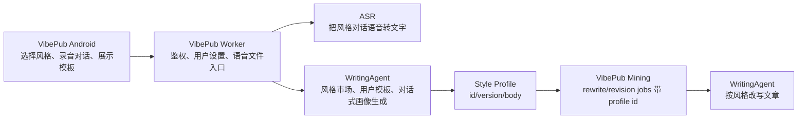

# Writing Style Marketplace Plan

本文定义 VibePub 与 WritingAgent 在“多写作风格模板、用户自定义提示词模板、通过多轮语音对话更新风格画像”上的产品和技术边界。

## 目标

- 用户可以在 Android App 设置里选择当前默认写作风格模板。
- WritingAgent 提供多种内置风格模板，并逐步演进为提示词市场。
- 用户可以新增自己的写作风格模板，模板可命名、预览、启用、停用和版本化。
- 用户新增或优化模板时，可以通过多轮语音/文字对话描述偏好，由 WritingAgent 逐步整理成稳定的风格画像提示词。
- 录音、上传音频、上传文字、后续说话修改文章都使用同一套当前选中的风格画像。

## 当前 MVP 状态

- Android 已支持内置模板选择。
- Android 已支持新增本地私有模板，并通过多轮系统语音识别或文字偏好追加提示词画像。
- 录音、导入音频和文字提交会把当前模板传入后端；本地私有模板使用 inline `style_profile_body`，内置模板使用 `style_profile_id`。
- Worker 会为音频任务写入 `profile-selections/*.json` sidecar，mining 读取后交给 WritingAgent。
- WritingAgent 已支持 inline 私有模板生成文章，但尚未持久化用户模板，也尚未提供跨设备模板市场。

## 职责边界



VibePub 保留：

- Android App 的设置页、风格选择 UI、录音入口和本地偏好。
- 用户鉴权、账号会话、设备诊断、状态展示。
- 语音采集和 ASR 调度。
- 公众号草稿创建/更新。

WritingAgent 接管：

- 公共风格模板市场。
- 用户自定义风格模板的存储、版本和发布。
- 风格画像对话草稿，把多轮用户表达合成为结构化提示词。
- 初次成文和后续修改文章时的风格应用。

## Android UX

设置页新增“写作风格”分组：

- 当前风格：显示名称、来源、版本和一句描述。
- 更换风格：进入风格模板列表。
- 新建我的风格：进入对话式创建流程。
- 管理我的风格：编辑名称、停用、复制、设为默认。

风格模板列表分三类：

- 推荐模板：WritingAgent 官方或项目内置模板。
- 我的模板：用户自己创建和迭代的模板。
- 最近使用：便于 dogfood 快速切换。

对话式创建流程：

1. 用户输入或说话回答：“你希望文章像谁/什么风格？”
2. App 把语音转成文字后提交为一轮 message。
3. WritingAgent 返回更新后的风格画像草稿、追问问题和置信度。
4. 用户继续说“更克制一点”“少一点标题党”“技术细节多保留”等。
5. 用户点击“保存为模板”，WritingAgent 发布一个 `style_profile_id + version`。
6. App 自动把该模板设为当前默认风格。

## 数据模型

StyleProfile:

```json
{
  "id": "style_user_abc123",
  "owner_user_id": "default_user",
  "workspace_id": "vibepub-dogfood",
  "visibility": "private",
  "name": "我的理性产品复盘风格",
  "description": "短开场、强判断、保留排查过程。",
  "version": "2026-07-05T06:58:00Z",
  "body": "完整风格画像提示词",
  "tags": ["产品", "技术", "复盘"],
  "status": "active",
  "created_at": "2026-07-05T06:58:00Z",
  "updated_at": "2026-07-05T06:58:00Z"
}
```

StyleProfileDraft:

```json
{
  "draft_id": "spd_abc123",
  "owner_user_id": "default_user",
  "workspace_id": "vibepub-dogfood",
  "target_profile_id": null,
  "messages": [
    {
      "role": "user",
      "source_type": "voice_transcript",
      "text": "我希望文章真实一点，不要营销味。"
    },
    {
      "role": "assistant",
      "text": "已提炼：真实、克制、少营销形容词。下一步想确认是否保留第一人称？"
    }
  ],
  "draft_profile": {
    "name": "真实克制写作风格",
    "description": "真实、克制、少营销形容词。",
    "body": "当前合成的风格画像提示词"
  },
  "status": "draft"
}
```

Android 本地偏好只保存：

```text
selected_style_profile_id
selected_style_profile_version
selected_layout_profile_id
selected_layout_profile_version
```

## API 草案

VibePub App 优先通过 VibePub Worker 调用，避免直接暴露 WritingAgent 服务 token。

VibePub Worker 面向 App：

```text
GET  /api/writing-style-profiles
GET  /api/writing-style-profiles/:id
PUT  /api/user-settings/default-style-profile
POST /api/writing-style-drafts
POST /api/writing-style-drafts/:draft_id/messages
POST /api/writing-style-drafts/:draft_id/publish
```

WritingAgent 面向服务端：

```text
GET  /v1/style-profiles
GET  /v1/style-profiles/:id
POST /v1/style-profiles
PUT  /v1/style-profiles/:id
POST /v1/style-profile-drafts
POST /v1/style-profile-drafts/:draft_id/messages
POST /v1/style-profile-drafts/:draft_id/publish
```

Mining 继续通过环境变量提供默认 fallback，但一旦 Android/Worker 有用户设置，后续应从录音记录或用户设置中取：

```text
style_profile_id
style_profile_version
layout_profile_id
layout_profile_version
```

## MVP 顺序

1. WritingAgent 增加多内置风格模板，并让 `/v1/style-profiles` 返回 market/my/recent 分类字段。
2. Android 设置页增加“写作风格”只读选择，先支持从内置模板选择并保存在本地偏好。
3. 上传录音/文字时把选中的 `style_profile_id` 写入 Worker 记录或 R2 payload，mining 使用该 profile 调用 WritingAgent。
4. Worker 增加用户默认风格设置，避免仅存在本地设备。
5. WritingAgent 增加用户自定义风格模板 CRUD。
6. 增加对话式风格草稿，先支持文字多轮，再接入语音 ASR。
7. Prompt 市场增加发布/复制/收藏/版本回滚。

## 安全与质量约束

- App 不直接持有 WritingAgent service token。
- 用户自定义 profile 必须归属 `user_id/workspace_id`，不能靠请求体自称身份。
- 风格画像 body 不应在公开列表里默认完整返回；市场列表只返回摘要。
- 对话式生成的 profile 发布前应展示完整内容给用户确认。
- 用户模板需要版本化，文章记录要保存当时使用的 `style_profile_id/version`，保证结果可追溯。
- WritingAgent 输出的 HTML 仍需要 sanitizer；风格模板不能绕过排版安全白名单。
